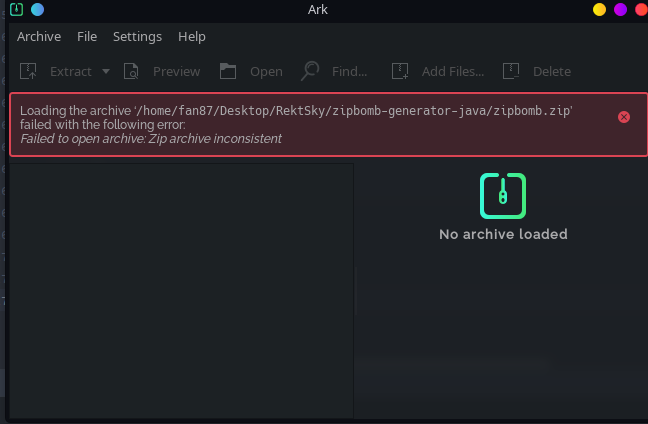
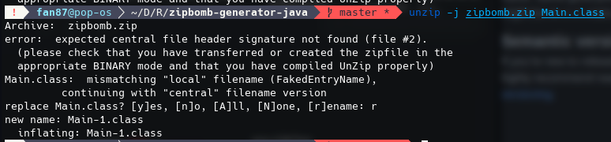
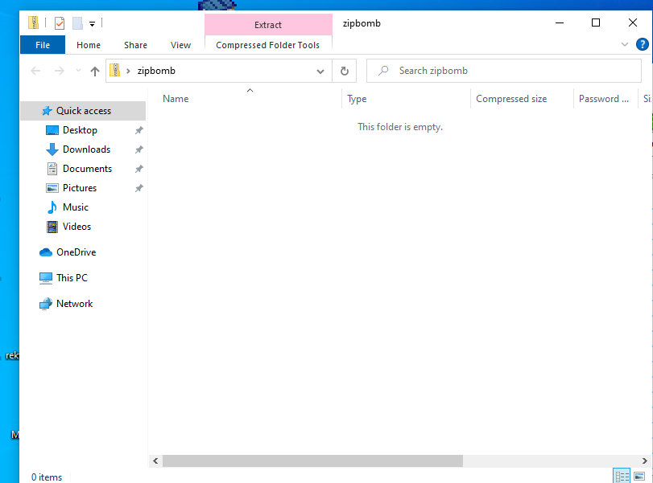
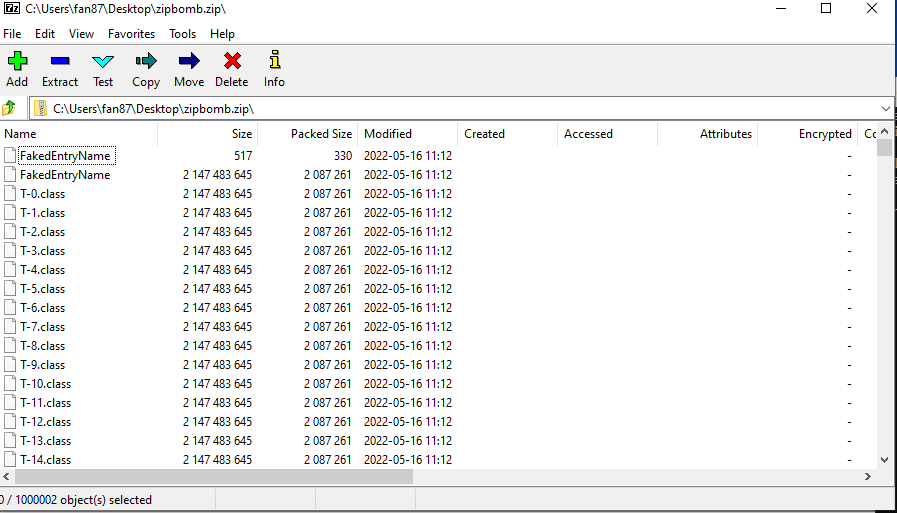
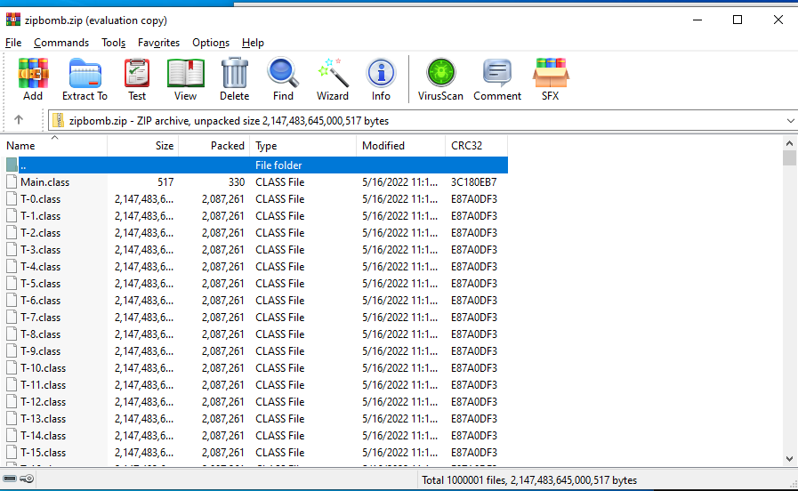
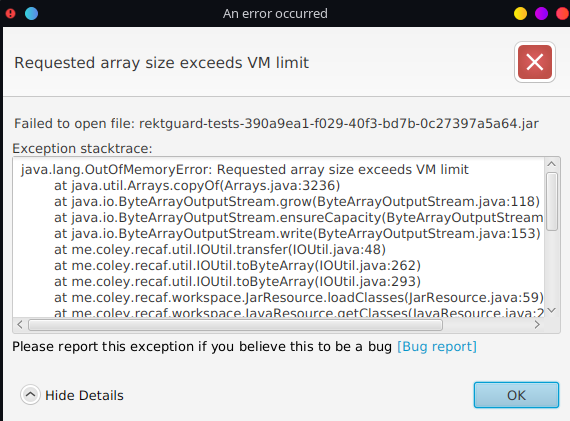
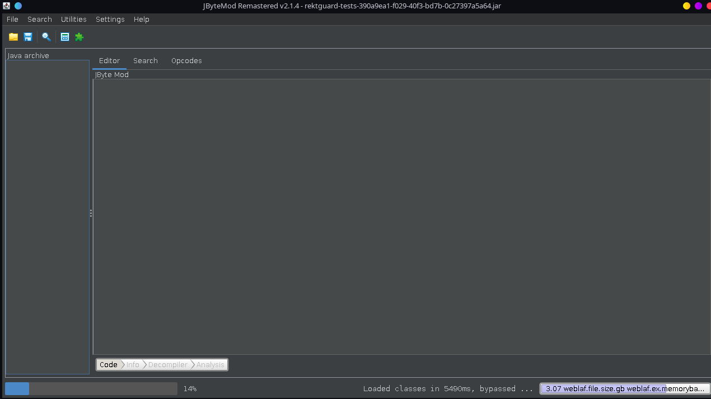
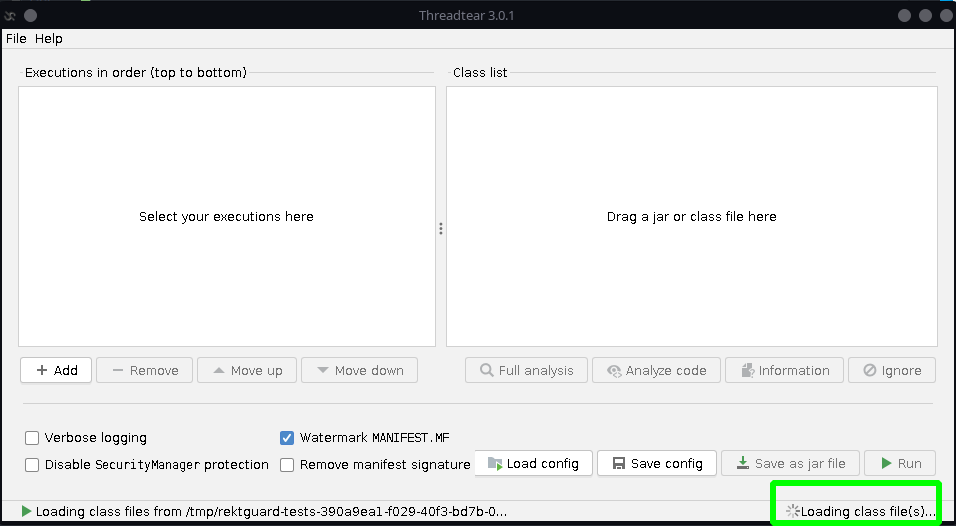

# ZipBomb Generator in Java

This library add all entries you want it to add, and make it a zipbomb + semi-invalid zip file as a (very) basic 
protection layer to protect your software from being cracked.

## Size Limit
The actual size limit should be Integer.MAX_VALUE, but the tested size limit is 1 million. I tested
10 million and it actually dies with `OutOfMemoryError`, and I didn't test anything between 1 million
and 10 million.

So let's say the size limit is 1 million, the unzip size should be 2.14 PB 
(`(Integer.MAX_VALUE - 2)*1000000 bytes`), which is more than enough.

## Features
#### **`ZipInputStream` File Name Faker**
> Fakes the file name from ZipInputStream. There are some deobfuscator uses this, and I'm talking to
> you - you are probably one of them who use this to code deobfuscation transformers.
> 
> It also hides file name from these following archive managers:
>  - 7-zip
> 
> But it doesn't work for these following archive managers:
>  - `unzip` Linux command
>  - WinRAR

#### **ZipBomb**
> It crashes most reversing tools. There are some tested tools:
>  - JBytemod
>  - JBytemod Remastered
>  - Recaf
>  - Bytecode Viewer
>  - Threadtear
> 
> Tools that's tested and working:
>  - None

#### **Semi Corrupted Zip File**
> Crashes some archive manager. There are all tested archive managers:
>  - `zip` Linux Command, tested with `zip -T`, results in `zip error: Nothing to do! (zipbomb.zip)`
>  - Ark (KDE's default archive manager) - crashes
>  - Gnome's Archive Manager - crashes
>  - Window's File Explorer - crashes
> 
> Archive Managers that's tested and don't work:
>  - WinRAR
>  - 7-zip, but the file name faker works
>  - `unzip` Linux Command
#### **Archive Manager Overload**
> As I said, the limit is pretty high (Tested: 1 mil, and in theory: max signed int (`int` limit in java))
> , which means there's a pretty high chance it'll freeze most unzipping tools for around 5 ~ 10 minutes
> 
> Tested archive managers (Exclude ones that crash or disallow unzipping):
>  - WinRar
> 
> Archive managers that's tested and don't work:
>  - `unzip` Linux command

## How does it work?
The main cause of the crash of unzip tools and differential between each unzip api is because JVM
actually has 2 (or probably 3) different zip/jar file parser. One is `ZipInputStream`, and another
one is `ZipFile`. JVM's class loader uses something similar to `ZipFile`, and using `ZipInputStream`
will result in different result.

Actually, I didn't find any archive manager that has the same result.
 - Windows' Builtin Archive Manager
 - 7-zip
 - WinRAR
 - Ark (KDE Plasma's default archive manager)
 - Gnome's Archive Manager
 - `unzip` command
 - `zip` command
 - JVM's class loader (`ZipFile`)
 - `ZipInputStream`

All of them parses the zip bomb crafted by this API differently, and has different result.
But there's no software that actually parses this correctly, the zip file is already corrupted,
the correct answer should be: Zip file corrupted, includes WinRAR, which is the one that bypasses
all of them, it's also parsing it incorrectly because it can still parse it without complaining.

This zipbomb is using a technique called `Overlapped Zipbomb`. Inside the zip file, there
are a few sections:
 - Local File Headers
 - Central Directory Headers
 - End Of Central Directory Record (EOCD)

Local File Headers contains file name, raw compressed data and other attributes, central directory
headers also have file name and other attributes, and the offset of the entry in local file headers
section. So you can know it as central directory file header has a pointer that points to its
local file header. EOCD contains information like how large is local file section and CD
section, how many entries are there in CD etc., so basically attribute of entire zip file,

But you can probably already tell that local file header and cd(central directory) header has a lot
of duplicated attributes, and if you make them unmatched, it will cause some issues.

First, JVM reads the file name at Central Directory Headers, but ZipInputStream and 7-zip reads
Local File Headers first, and if it can't find the entry (Which I'll talk about it later), it will
use the file name at Central Directory Headers.

Also, some unzip tools like `Ark`, `Gnome's Archive Manager` already crashed with unmatched file name.

Now next thing is `Overlapped`, you can change the pointer in CD header to same local file with
unmatched file name, so if you point like 100000 entries to one 2GB local file, it will result
in having 100000 2GB entries with only 1 entry's actual data stored. Overlapped means that
they are pointing to the same local file, and those data are overlapped.

There are some more technique going on, you can find those by messing around, and I recommend you to
try it yourself, it's fun and you can learn a lot (If it's your first time doing it)

## How does it protect your Java programs from being cracked?
JVM won't crash while loading a zipbomb as class path, and funny enough, it can find classes
correctly in the zipbomb. If you try and load it with tools, it will die, because those tools are
actually listing all entries of it, and some of them are even loading every single of them, or
store all of them into 1 single array. If you do that, your program will freeze, well, not technically
a "crash", but you'll have to wait fo around 100 years.

So there you go, most unzip tools die (except WinRAR and `unzip` Linux command), and it's great
enough to stop skids who don't know anything but using recaf to change the source and recompile it.

It's also a good idea to use it as a final protection layer of your obfuscator.

## Example
You can find examples in the release tab!

## Use cases
This is obviously for obfuscation and educational purposes only, and I'm dead serious, using this
to do bad stuff is actually very stupid, and you shouldn't be doing it under any condition.

1. Learn how the code works
2. Learn how Zipbomb works
3. Protect your Java programs
4. Security usage (e.g. test if your software has prevented zipbomb)

## Usage
1. Clone this repository, and `mvn clean package install`
2. Add this to `pom.xml`:
```xml
<dependency>
    <groupId>ml.rektsky</groupId>
    <artifactId>zipbomb-generator-java</artifactId>
    <version>1.0-SNAPSHOT</version>
</dependency> 
```
3. Example Usage:
```java

public class Main {
    public static void main(String[] args) {
        OutputStream outputStream = Files.newOutputStream(Paths.get("zipbomb.zip"));
        // Create an instance with custom configuration
        ZipBombGenerator zipBombGenerator = new ZipBombGenerator.Builder(index -> "T-" + index + ".class", (short) (Short.MAX_VALUE - 1), Integer.MAX_VALUE - 2)
                .fakeEntryName("FakedEntryName")
                .build();

        Map<ZipEntry, byte[]> files = new HashMap<>();
        // Add a file to the zip file
        // You can also read all entries from a zip file using ZipInputStream
        FileInputStream fileInputStream = new FileInputStream("Main.class");
        files.put(new ZipEntry("Main.class"), IOUtils.readNBytes(fileInputStream, Integer.MAX_VALUE));

        // Zipbomb it, it may take a while to run
        byte[] bytes = zipBombGenerator.create(files);

        // Write the zipbomb output to the file
        outputStream.write(bytes);
        outputStream.close();
    }
    
}
```

## Gallery
Ark


Gnome Archive Managers


`unzip` Linux Command


Windows Archive Manager


7-zip
(Showing fake file name `FakeEntryName`(customizable), the real names are `T-0.class` (probably)
and `Main.class`)


WinRAR
(It works well except it takes 20 minutes to load)



Recaf





JBytemod Remastered
(JBytemod should result in the same)


Threadtear
(It takes forever to load)
